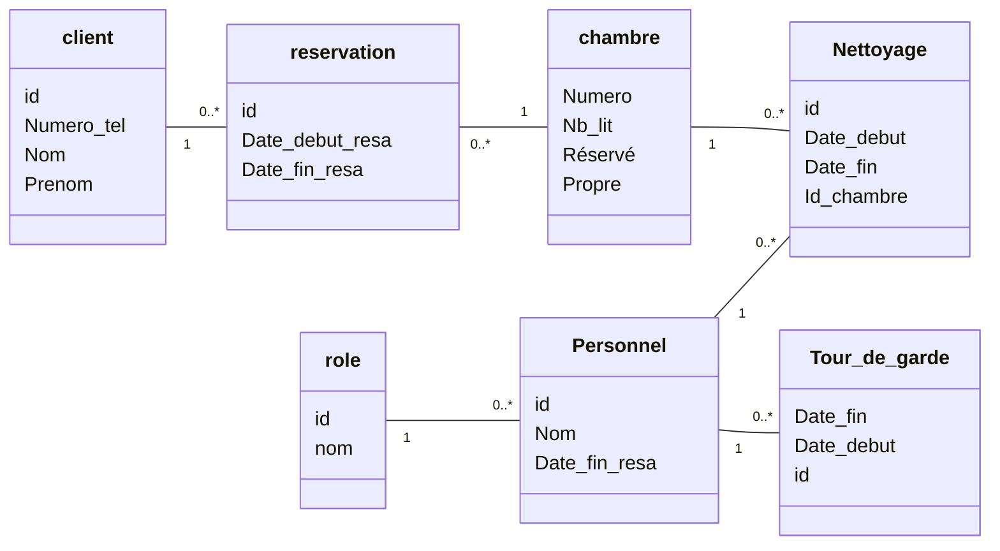

# Schéma UML — Hôtel-casino

Transcription du schéma fourni en image, avec les mêmes champs et cardinalités.

```mermaid
classDiagram
    direction LR

    class client {
        id
        Numero_tel
        Nom
        Prenom
    }

    class reservation {
        id
        Date_debut_resa
        Date_fin_resa
    }

    class chambre {
        Numero
        Nb_lit
        Réservé
        Propre
    }

    class Nettoyage {
        id
        Date_debut
        Date_fin
        Id_chambre
    }

    class role {
        id
        nom
    }

    class Personnel {
        id
        Nom
        Date_fin_resa
    }

    class Tour_de_garde {
        Date_fin
        Date_debut
        id
    }

    client "1" -- "0..*" reservation
    reservation "0..*" -- "1" chambre
    chambre "1" -- "0..*" Nettoyage
    Personnel "1" -- "0..*" Nettoyage
    role "1" -- "0..*" Personnel
    Personnel "1" -- "0..*" Tour_de_garde
```
